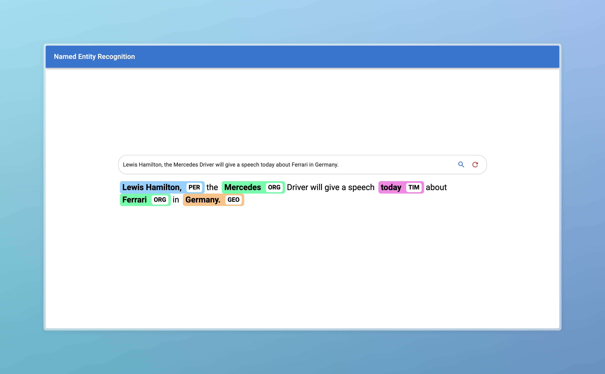

# BERT-NER-Tagger

A simple end-to-end web application to perform Natural Entitiy Recognition


## Setup

1. Clone the repository
2. Install the required packages
```bash
cd backend
pip install -r requirements.txt
```
3. Run the backend server
```bash
uvicorn main:app --host 0.0.0.0 --port 8000
```
4. Run the frontend server
```bash
cd ../frontend
npm install
npm start
```
5. Open the browser and go to `http://localhost:3000`

## Usage

1. Enter the text in the text area 

2. Press `Enter` or click on the search button
3. The entities will be highlighted in the text

